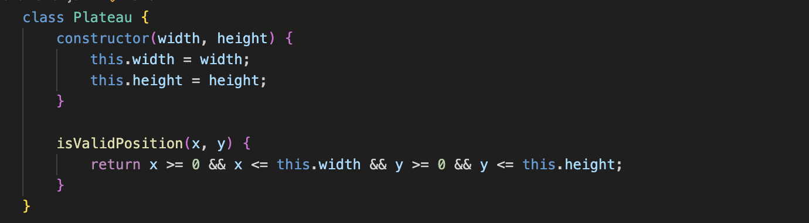
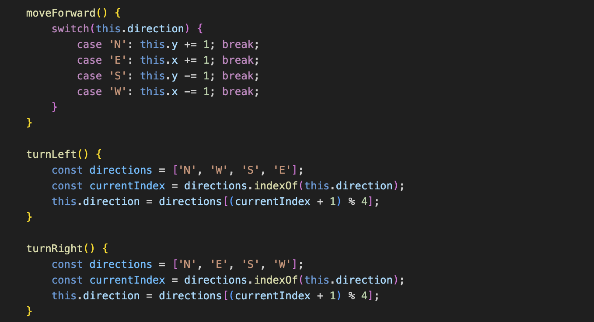
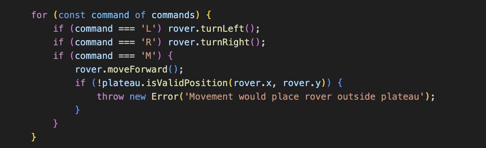

# Mars Rover Technical Challenge

## Approach
I broke this problem down into manageable components:

1. Plateau Class
- Represents the rectangular plateau
- Handles boundary validation

2. Rover Class
- Manages rover position and direction
- Handles movement and rotation commands

3. Command Processing
- Processing of rover commands
- Input parsing and output formatting

## Design Decisions
- Used classes to maintain clean object-oriented design
- Kept methods focused and single-purpose
- Added basic error handling for invalid moves
- Used descriptive naming for clarity

## Example Input

## Testing
Added test cases to verify:
- Basic movement and rotation
- Edge cases (plateau boundaries)
- Multiple rover coordination

## Implementation Highlights

### Plateau Validation
The Plateau class ensures rovers stay within the defined boundaries:

### Core Movement Logic
The heart of the solution - how rovers move and rotate:

### Command Processing
How commands are processed and validated:

## Example Input

